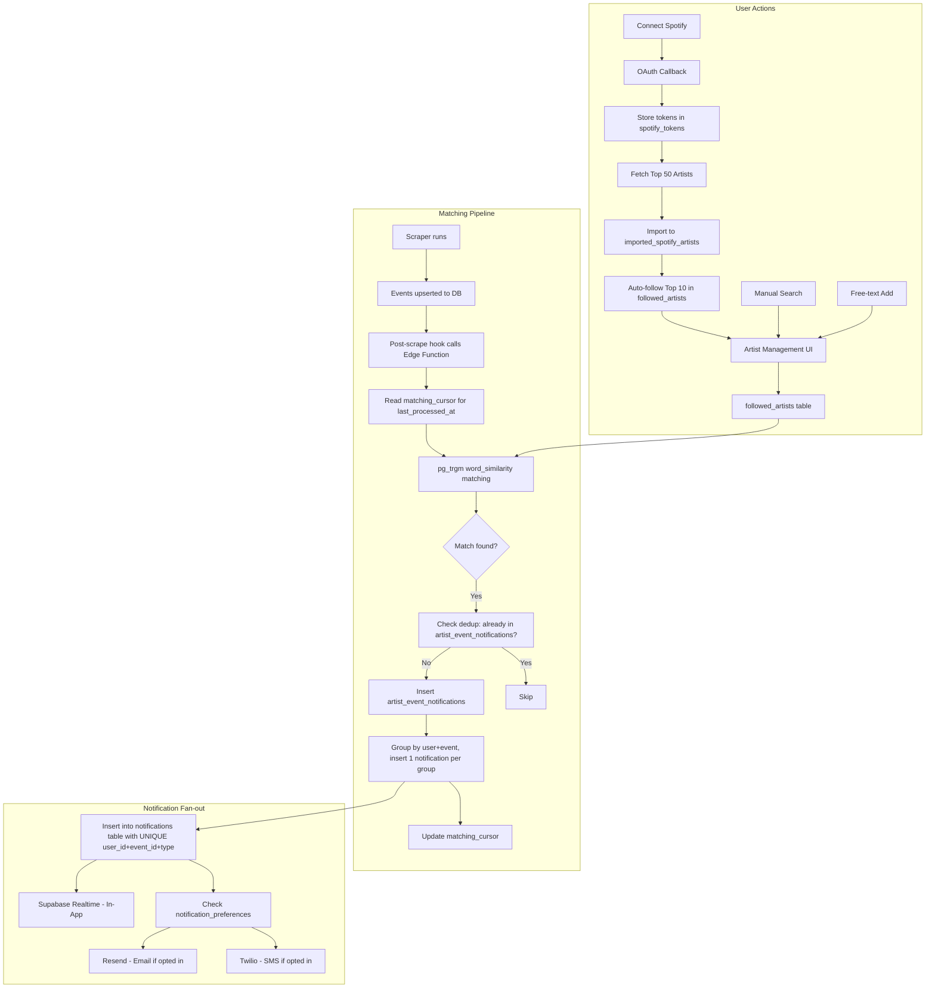
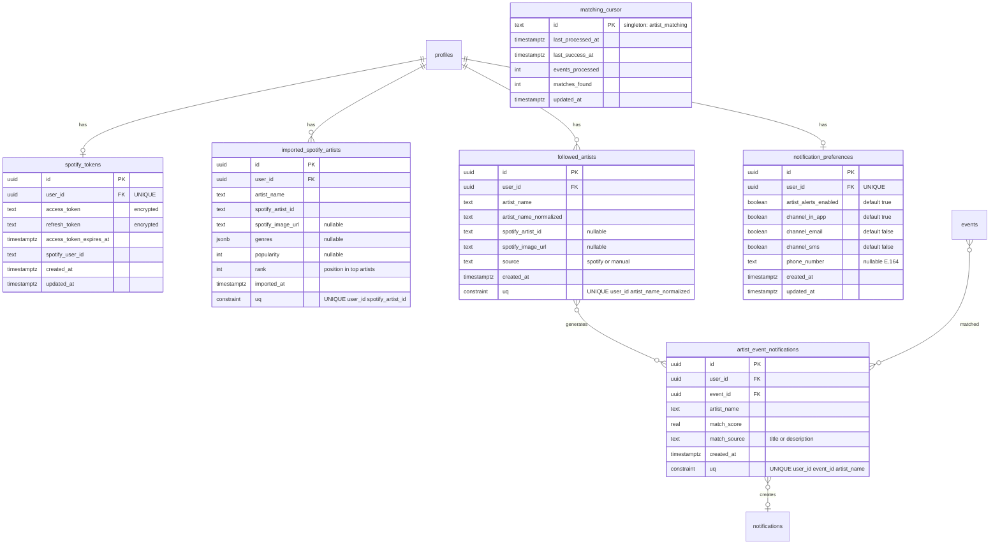

# Spotify Artist Alerts: Follow Artists, Get Notified on Events

## Overview

Enable users to follow music artists and receive multi-channel notifications (in-app, email, SMS) when followed artists have events in Austria. Artists can be sourced from Spotify (auto-import top artists) or added manually (search + free-text). The system continuously monitors the ~109K+ event database for matches against followed artists and fans out notifications to all followers.

**Existing foundation**: Spotify OAuth, token management, basic `.includes()` matching, `spotify_artist_matches` table, `notifications` table with `spotify_match` type, NotificationBell with Realtime subscriptions -- all exist but are incomplete or disconnected.

## Scope

### In scope
- `spotify_tokens` server-only table for secure token storage (replaces profile columns)
- `imported_spotify_artists` staging table for top 50 Spotify artists (not yet followed)
- `followed_artists` table decoupled from Spotify (only contains actively followed artists)
- Refactor Spotify OAuth callback: store tokens in `spotify_tokens`, import top 50 to staging, auto-follow top 10
- Artist management UI: top 10 pre-selected from Spotify, search (Spotify API), manual add, follow/unfollow
- Spotify search API integration (Client Credentials flow for app-level access)
- Improved artist-event matching engine using `pg_trgm` word_similarity + guards for short names
- Post-scrape matching hook + pg_cron fallback via Supabase Edge Function
- Notification fan-out: in-app (existing infra), email (Resend), SMS (Twilio)
- User notification preferences (channel selection, phone number)
- Notification deduplication: max 1 notification per (user, event) regardless of matched artist count
- GDPR/DSGVO compliant opt-in for email/SMS
- `matching_cursor` state table for incremental matching with idempotent replay

### Out of scope
- Spotify Extended Quota Mode application (documented as known limitation)
- Push notifications (web push / mobile)
- Geographic filtering on alerts (e.g. "only Wien")
- AI/ML artist-event matching (semantic embeddings)
- Admin dashboard for pipeline health monitoring
- Digest mode (daily/weekly email summary) -- future enhancement
- Migration of existing `spotify_artist_matches` data (deferred, old table kept as-is)

## Architecture





### Key Design Decisions

**Token security**: Spotify tokens are stored in a dedicated `spotify_tokens` table with NO RLS SELECT for authenticated users. Only `service_role` can read tokens. The `profiles` table columns `spotify_refresh_token` and `spotify_connected` are deprecated; `spotify_tokens` is the new source of truth. Client code checks connectivity via `GET /api/spotify/status` (server-side query to `spotify_tokens`).

**Imported vs followed separation**: Spotify callback imports all 50 top artists into `imported_spotify_artists` (staging). The top 10 by rank are auto-inserted into `followed_artists`. The artist management UI shows the full 50 from staging with the top 10 pre-toggled on. Users can toggle any on/off, which adds/removes rows from `followed_artists`. This separation prevents 50 phantom follows.

**Hard delete, not soft delete**: `followed_artists` uses hard DELETE (not `active=false`). Re-follow is a fresh INSERT. This avoids the unique constraint conflict with soft-deleted rows and simplifies the API (no upsert reactivation logic).

**Notification dedup**: `notifications` table gets a unique partial index on `(user_id, event_id)` WHERE `type = 'spotify_match'`. When multiple artists match the same event for a user, only ONE notification is created listing all matched artist names in the body. The `artist_event_notifications` table tracks per-artist matches for analytics.

**Matching schedule**: The pipeline runs as a **post-scrape hook** (called from `src/scripts/scrape.ts` after `syncEventsToSupabase()` completes) AND via pg_cron every 5 minutes as a fallback catch-all. This meets the <5 minute SLA.

**Email precedence**: Users receive notifications at their Supabase Auth email. The `email_override` field is removed from the schema -- Supabase Auth email is the single source of truth.

**Incremental matching**: The `matching_cursor` table stores `last_processed_at` -- the pipeline only matches events with `updated_at > last_processed_at`. On failure, the cursor is not advanced, so the next run replays the same window. Backfill is possible by resetting the cursor to an earlier timestamp.

**Description matching strategy**: `events.title` gets a GIN trigram index for fast pg_trgm queries. `events.description` does NOT get a trigram index (too expensive for 109K rows of HTML text). Instead, description matching uses a secondary exact substring check (`POSITION(lower(artist_name) IN lower(description)) > 0`) only for candidates already matched by title OR for artists with names >= 6 characters.

## Phases

### Phase 1: Data Foundation (Tasks 1-2)
Database schema (spotify_tokens, imported_spotify_artists, followed_artists, artist_event_notifications, notification_preferences, matching_cursor), migrations, RLS policies, pg_trgm setup, GIN indexes. Spotify callback refactor to use new tables.

### Phase 2: Artist Discovery (Tasks 3-4)
Spotify search API (Client Credentials), artist management UI with imported artists staging, top 10 pre-selection, manual add, search.

### Phase 3: Matching Engine (Task 5)
pg_trgm-based matching with word_similarity, minimum name length guards, normalization, per-artist dedup, grouped notification creation.

### Phase 4: Pipeline and Notifications (Tasks 6-8)
Post-scrape hook + pg_cron Edge Function, matching_cursor state management, Resend email integration, Twilio SMS integration.

### Phase 5: Preferences and Polish (Tasks 9-10)
Notification preferences UI, phone number validation, E2E testing, documentation updates.

## Alternatives Considered

| Option | Pros | Cons | Decision |
|--------|------|------|----------|
| Client-side matching (current) | Simple | Does not scale, no re-matching | **Rejected** -- move to server-side pg_trgm |
| Database trigger on event INSERT | Real-time, no cron needed | Write amplification on bulk scraper upserts, Edge Function concurrency limits | **Rejected** -- too many triggers during scraper runs |
| Post-scrape hook + pg_cron fallback | Immediate + reliable, <5 min SLA | Slightly more complex | **Chosen** -- meets latency SLA with fallback |
| Embedding-based semantic matching | Handles misspellings, translations | Overkill, complex infrastructure, expensive | **Deferred** -- pg_trgm sufficient for artist names |
| Supabase Auth Spotify provider | Built-in, less code | Cannot control token storage, no Client Credentials flow | **Rejected** -- keep custom OAuth for token control |
| Token in profiles column + RLS | Simple | RLS is row-level not column-level; client `select('*')` exposes token | **Rejected** -- separate server-only table |
| Soft delete on followed_artists | Preserves history | Unique constraint conflicts on re-follow, complex upsert logic | **Rejected** -- hard delete is simpler |
| GIN index on events.description | Fast fuzzy on description | 109K HTML rows, huge index, diminishing returns | **Rejected** -- use cheap substring check as secondary |

## Non-Functional Requirements

- **Matching latency**: < 5 minutes from event insertion to notification delivery (post-scrape hook = immediate; pg_cron fallback = 5 min max)
- **False positive rate**: < 5% for artist names >= 4 characters
- **Notification delivery**: In-app immediate (Realtime), email within 1 minute, SMS within 2 minutes
- **Database performance**: pg_trgm GIN index on events.title, matching query < 500ms for 200 followed artists against 109K events
- **Token security**: Spotify tokens in dedicated server-only table, no client-side access, no RLS SELECT for authenticated role
- **GDPR compliance**: Email/SMS off by default, explicit opt-in required, unsubscribe in every email

## Risks and Mitigations

| Risk | Likelihood | Impact | Mitigation |
|------|-----------|--------|------------|
| Spotify Dev Mode 5-user limit | Certain | High -- blocks public launch | Ship manual-first. Spotify behind feature flag. Apply for Extended Quota separately. |
| False positive matches for short names | High | Medium -- spam, user trust | Minimum 3-char names use exact word match; 4+ use pg_trgm threshold 0.6; 1-2 char names blocked |
| pg_cron not available on free tier | Medium | High -- no automated pipeline | Check plan tier. Fallback: post-scrape hook still works, manual npm script as last resort |
| Resend/Twilio API failures | Low | Medium -- missed notifications | Retry queue with 3 attempts, exponential backoff |
| Notification flood from festival events | Medium | Medium -- user annoyance | Max 1 notification per (user, event) via unique partial index; body lists all matched artists |
| Matching cursor lost/corrupted | Low | Medium -- duplicate or missed notifications | Idempotent replay: cursor reset = safe re-process; unique constraints prevent duplicate notifications |

## Rollout Plan

1. **Phase 1-2**: Deploy DB schema + artist management UI. Manual-only follows first.
2. **Phase 3**: Deploy matching engine. Dry-run mode first, log matches without notifying.
3. **Phase 4**: Enable in-app notifications. Monitor for false positives. Then enable email, then SMS.
4. **Phase 5**: Preferences UI. Full rollout.

**Rollback**: Each phase independently revertible. Edge Function can be disabled via Supabase dashboard.

## Metrics

- Followed artists count per user (avg, p50, p90)
- Match accuracy (false positive reports / total matches)
- Notification delivery rate per channel
- Spotify connect rate (connects / profile views)
- Artist alert click-through rate

## Quick commands

```bash
# Run matching pipeline manually (after implementation)
npx tsx src/scripts/match-artists.ts --dry-run

# Check followed artists for a user
npx tsx src/scripts/match-artists.ts --user-id <uuid> --dry-run

# Reset matching cursor (re-process all events)
npx tsx src/scripts/match-artists.ts --reset-cursor --dry-run

# Run tests
npm test
```

## Acceptance

- [ ] Spotify tokens stored in dedicated `spotify_tokens` table, not accessible client-side
- [ ] Spotify callback imports top 50 artists to staging, auto-follows top 10
- [ ] Users can follow artists via Spotify staging or manually (search + free-text)
- [ ] Artist management UI shows imported artists with top 10 pre-toggled, plus search and manual add
- [ ] Spotify search returns artist results for connected and non-connected users
- [ ] When a new event with a followed artist appears, all followers are notified within 5 minutes
- [ ] Max 1 notification per (user, event) via unique partial index, body lists all matched artists
- [ ] Notifications delivered via in-app (immediate), email (Resend), and SMS (Twilio)
- [ ] User can configure notification channels (in-app/email/SMS) and provide phone number
- [ ] Email/SMS are off by default (GDPR opt-in), unsubscribe in every email
- [ ] Short artist names (< 4 chars) use stricter matching to avoid false positives
- [ ] pg_trgm GIN index on events.title ensures matching performance at scale
- [ ] Matching cursor enables incremental processing with idempotent replay
- [ ] Hard delete on unfollow (no soft delete / active flag)
- [ ] All existing tests pass, new features have test coverage
- [ ] CLAUDE.md, CHANGELOG.md, HANDOFF.md updated

## References

- Existing Spotify code: `src/lib/spotify.ts`, `src/app/auth/spotify/callback/route.ts`, `src/app/spotify-matches/page.tsx`
- Notification infra: `src/components/Notifications/NotificationBell.tsx`, `src/app/notifications/page.tsx`
- Fuzzy matching: `src/lib/dedup/jaro-winkler.ts`
- DB sync pipeline: `src/lib/db/supabase-sync.ts`
- Scraper entry: `src/scripts/scrape.ts`
- Auth context: `src/lib/supabase/auth-context.tsx`
- [Spotify Web API - Top Artists](https://developer.spotify.com/documentation/web-api/reference/get-users-top-artists-and-tracks)
- [Spotify Web API - Search](https://developer.spotify.com/documentation/web-api/reference/search)
- [Spotify Client Credentials Flow](https://developer.spotify.com/documentation/web-api/tutorials/client-credentials-flow)
- [PostgreSQL pg_trgm](https://www.postgresql.org/docs/current/pgtrgm.html)
- [Supabase Edge Functions - Schedule](https://supabase.com/docs/guides/functions/schedule-functions)
- [Supabase Vault](https://supabase.com/docs/guides/database/vault)
- [Resend + Supabase](https://resend.com/docs/send-with-supabase-edge-functions)
- [Twilio Node.js](https://www.twilio.com/docs/messaging/quickstart/node)

## Known Limitations

- **Spotify Development Mode**: Limited to 5 authorized users. Manual artist following works for all users. Spotify integration should be behind a feature flag until Extended Quota is approved.
- **No dedicated artists column on events table**: Matching runs against title + description. Adding a derived column is deferred to avoid modifying 141 scrapers.
- **Event descriptions may contain negations**: pg_trgm cannot detect negation. Accepted as a low-frequency edge case.
- **No GIN index on events.description**: Description matching uses cheap substring check as secondary strategy, not pg_trgm fuzzy.
