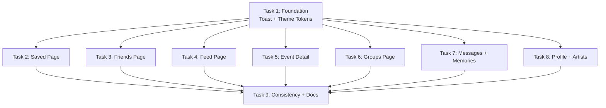

# Social Features Launch-Ready: UX/Logic Fix

## Overview

Fix 24 UX/logic issues across 9 social pages (Saved, Friends, Feed, Messages, Memories, Groups, Profile, Artists, Event Detail) to make the app launch-ready. Every visible touchpoint must navigate or act; every mutation must give feedback; all pages must share one dark theme.

**NOT in scope:** Redesign, new features beyond the 24 listed, backend refactoring, Artists feature changes (only theme).

## Stakeholders

- **End users**: All social pages get navigation fixes, feedback on actions, consistent dark theme
- **Developers**: New toast system (Sonner), dark theme tokens via Tailwind `@theme`, standardized loading patterns
- **Operations**: Zero deployment/config changes — pure frontend

## Architecture & Key Decisions

### Toast System
- **Library:** Sonner (shadcn/ui standard, 12k+ stars, Next.js compatible)
- **Mount:** `<Toaster />` in root `layout.tsx` (persists across route changes)
- **Pattern:** `toast.success()` / `toast.error()` for all user-initiated mutations
- **Classification:** Only user-initiated actions (save/unsave/friend/message/upload/RSVP) get toasts. Background fetch failures stay as error boundaries or silent.

### Dark Theme Tokens
- **Canonical background:** `#0a0a0c` → defined as `--color-surface` via Tailwind v4 `@theme` in `globals.css`
- **Elevated surface:** `#141416` → `--color-surface-elevated` (cards, modals)
- **All hardcoded hex values** replaced with `bg-surface` / `bg-surface-elevated` utilities

### Navigation Decisions
- **Feed event click:** → `/events/[id]` (not `/map?eventId=...`)
- **Event detail back:** `router.back()` with `window.history.length > 1` fallback → `/`
- **Saved card click:** Entire card wrapped in `<Link href="/events/[id]">`, unsave button uses `e.stopPropagation()`
- **Friend name/avatar:** `<Link href="/profile/[userId]">` (or `/friends/[userId]` if profile route exists)
- **Group event link:** Always link to `/events/[id]`, regardless of `source_url`

### Removed vs Fixed
- **Facebook button on profile:** REMOVE (no App ID, not implementable in scope)
- **PostMenu "Melden" button:** REMOVE (no backend report endpoint)
- **Groups widget system:** DELETE dead code entirely
- **Bookmark icon:** Saved page uses bookmark (not heart). FeedItem.tsx already uses correct bookmark pattern — follow that.

### Mobile/Touch Pattern
- **Destructive actions (delete contribution, unsave):** Always-visible icon button, no hover-only
- **CSS guard:** `@media (hover: hover)` for any remaining hover enhancements
- **Min touch target:** 44x44px per Apple HIG

### Access Control (Client-Side UX Guards)
- **Groups:** Non-members see group info + "Join" prompt, chat/contributions hidden behind `<MemberOnly>` guard
- **DMs:** Validate recipient is friend before rendering compose UI; show "Add as friend first" if not
- **Note:** These are UX guards only. Real security is Supabase RLS (not in scope).

## Phases

### Phase 1: Foundation (Task 1)
Install Sonner, define `@theme` tokens, create toast provider. All subsequent tasks depend on this.

### Phase 2: Page-Level Fixes (Tasks 2-8, parallelizable)
Each task fixes one page or page group. Minimal file overlap enables parallel execution.

### Phase 3: Consistency Pass (Task 9)
Unify loading patterns, auth states, and background colors across all pages. Depends on Phase 2.

## Mermaid: Task Dependencies



## Alternatives Considered

1. **Custom toast instead of Sonner:** Higher effort, no benefit. Sonner is battle-tested with Next.js.
2. **CSS variables instead of `@theme`:** Possible but misses Tailwind utility generation. `@theme` is the v4 standard.
3. **Keep report button with fake confirmation:** Misleads users. Removing is more honest.
4. **Swipe-to-delete for mobile:** Too complex for launch day. Always-visible buttons are simpler and more discoverable.

## Non-Functional Targets

- All social pages load < 2s on 3G (no new heavy dependencies)
- Zero hydration errors from `window.history` access (event handlers only, not render)
- Sonner bundle: ~5KB gzipped — negligible impact
- Touch targets ≥ 44x44px on all interactive elements

## Rollout & Rollback

- **Rollout:** Single branch, all tasks committed, deploy via Coolify git push
- **Rollback:** `git revert` the merge commit if critical issues found post-launch
- **No feature flags needed** — these are fixes to existing features, not new features

## Risks & Mitigations

| Risk | Impact | Mitigation |
|------|--------|------------|
| Sonner incompatible with React 19 | Toast system fails | Verify with `npm ls react` before proceeding; fallback: react-hot-toast |
| Theme token changes cascade beyond scope | Unintended visual changes on non-social pages | Token names are new (`bg-surface`), not replacing existing utilities |
| fn-1 tasks 11/12 overlap (animations, chat) | Merge conflicts on social components | fn-1 tasks are not started; this epic ships first |
| 24 fixes in one day | Regressions | Tasks are parallelizable; each task has focused scope |
| No test coverage for social features | Silent regressions | Add smoke tests in consistency task; run full `npm test` + `npm run build` |

## Quick commands

```bash
npm run dev                 # Dev server
npm test                    # Run all 547 tests
npm run build               # Production build (TypeScript strict)
npx sonner --version        # Verify Sonner installed
```

## Acceptance

- [ ] Every visible touchpoint (card, avatar, name, button) navigates or triggers an action
- [ ] Every user-initiated mutation (create/update/delete) shows toast feedback
- [ ] Zero dead buttons, zero dead links, zero silent errors on user actions
- [ ] All social pages use `bg-surface` (#0a0a0c) or `bg-surface-elevated` (#141416) consistently
- [ ] Event detail page has Save + Share + dynamic Back button
- [ ] Artists page converted to dark theme
- [ ] Mobile: all actions accessible without hover, touch targets ≥ 44px
- [ ] `npm run build` passes with zero errors
- [ ] `npm test` passes (547+ tests)
- [ ] CHANGELOG.md updated with Phase 11 entry
- [ ] CLAUDE.md updated with toast component path

## References

- Sonner: https://sonner.emilkowal.ski/
- Tailwind v4 @theme: https://tailwindcss.com/docs/theme
- Next.js useRouter: https://nextjs.org/docs/app/api-reference/functions/use-router
- Framer Motion AnimatePresence: https://motion.dev/docs/react-animate-presence
- Existing patterns: `src/components/Feed/FeedItem.tsx` (bookmark icon), `src/components/Notifications/NotificationToast.tsx` (toast UI reference)
