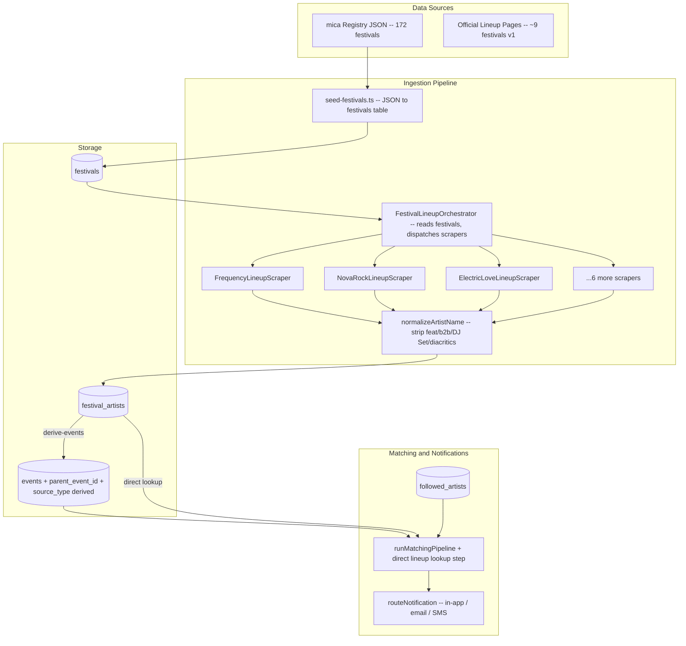
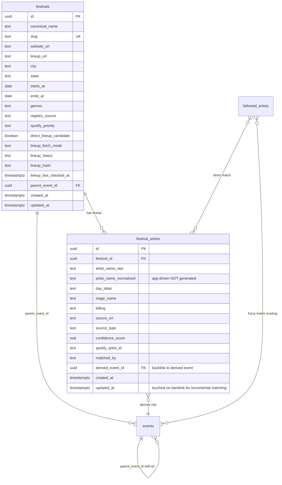

# Festival Lineup Ingestion Pipeline

## Overview

Transform the platform's festival handling from single-event entries into a structured parent-child hierarchy: **Festival -> Lineup Artists -> Derived Artist Events**. This closes the critical gap where festival-attending artists are invisible to the Spotify follow-matching system because lineups don't appear in event titles/descriptions.

**Core problem:** A user following "Volbeat" on Spotify gets no notification for Nova Rock 2026 because the parent event is just "Nova Rock 2026" -- the artist name appears nowhere in `events.title` or `events.description`. The current text-based pg_trgm matcher cannot find what isn't there.

**Solution:** Scrape official lineup pages, store structured `festival_artists` rows, generate derived events ("Volbeat at Nova Rock 2026") in the existing `events` table, and add a direct-lookup matching path that bypasses fuzzy text search for known lineup data.

## Scope

**In scope:**
- New DB tables: `festivals`, `festival_artists`
- Extend `events` table: `parent_event_id` FK, widen existing `source_type` constraint to include `'derived'`
- Widen `artist_event_notifications.match_source` constraint to include `'lineup'`
- Artist name normalization module (feat., b2b, DJ Set, Live, diacritics, collaboratives)
- 9 lineup scrapers for high-value festivals with confirmed public lineup pages
- Festival seed script for 172-entry mica austria 2026 registry
- Lineup scraper orchestrator + CLI script (`npm run scrape:festival-lineups`)
- Derived event generator (festival_artists -> events rows)
- Direct-lookup matching path in `runMatchingPipeline`
- Lineup change detection (hash-based watcher for incremental updates)
- Notification wiring for derived events
- CLAUDE.md + CHANGELOG.md documentation updates

**Out of scope (v1):**
- Blog post lineup arrays migration (52 posts with static `LineupAct[]` stay as-is)
- Festival detail UI page (derived events render via existing `/events/[slug]` page)
- Map clustering for derived events under parent festival pin
- Instagram/Facebook/poster OCR lineup extraction
- Ticketing portal fallback scrapers (oeticket, Frontstage)
- Festival cancellation workflow
- Admin UI for manual lineup curation

## Architecture



### Data Model



### Key Design Decisions

1. **Derived events go into `events` table** (not a separate table). This ensures they appear on the map, in search, in APIs, and in scoring without touching any existing consumer. `source_type = 'derived'` + `parent_event_id` FK distinguishes them.

2. **Lineup scrapers are a separate module** (`src/lib/lineup/`), NOT in the flat scraper array in `src/lib/scrapers/index.ts`. They return `FestivalArtist[]` not `ScrapedEvent[]`, and run in a distinct pipeline step after normal scrapers.

3. **Dedup bypass** for derived events: derived events are NOT passed through `deduplicateEvents()` at all -- they bypass the scraper pipeline and go directly into `events` via upsert ON CONFLICT content_fingerprint. No modification to the dedup module needed.

4. **Direct-lookup matching path**: New step in `runMatchingPipeline` calls an RPC with an app-normalized name array (using the lineup normalizer, NOT the DB-stored `followed_artists.artist_name_normalized` which is only `lower()`). The RPC matches against `festival_artists.artist_name_normalized` via btree equality. Deterministic, high-confidence, fast. Runs BEFORE the existing fuzzy text-search steps. Existing fuzzy/exact RPCs exclude `source_type = 'derived'` to prevent false positives from derived event titles.

5. **Lineup hash for change detection**: `sha256(sorted normalized artist names joined by '|')` stored on `festivals.lineup_hash`. Re-scrape only processes diff when hash changes.

6. **Festival-event linking**: Each `festivals` row stores a `parent_event_id` pointing to the corresponding parent event in `events`. Derived events also get `parent_event_id` pointing to the same parent event. Hierarchy: event (parent) <- festivals (metadata) + events (derived children).

### Alternatives Considered

| Option | Rejected Because |
|--------|-----------------|
| Separate `derived_artist_events` table | Every existing API, map query, filter, and scoring algorithm would need JOIN logic. Integration cost too high. |
| Extend `BaseScraper` to return lineup data | Type contract (`ScrapedEvent[]`) is fundamentally different from `FestivalArtist[]`. Would pollute the base class. |
| Store lineups only in blog `LineupAct[]` | Static TypeScript, not queryable, not connected to Spotify matching. |
| Reuse `event_series_id` for parent-child | Series = recurring (weekly pub quiz). Festival = one-time with sub-events. Semantically different. |
| Use `venue_id` for festival location | `VenueType` enum lacks festival grounds; adding 172 venues would bloat the venues table with non-venue entries. |

## Non-Functional Targets

- **Seed import**: < 30s for 172 festivals (single batch upsert)
- **Lineup scrape cycle**: < 5min for all 9 scrapers (1-2s rate limit per domain)
- **Derived event generation**: < 10s for 1,500 festival_artists -> events upserts
- **Direct-lookup matching**: < 2s for 200 users x 20 follows x 1,500 lineup entries (indexed JOIN)
- **Incremental update**: Only process changed lineups (hash comparison), not full re-derive

## Rollout Plan

**Phase 1 -- Foundation (Tasks 1-2):** DB schema + types + seed script. No user-visible changes.
**Phase 2 -- Normalization (Task 3):** Artist name normalization module with tests. Reusable utility.
**Phase 3 -- Scraping (Tasks 4-5):** Lineup scrapers for 9 high-value festivals. Data flows into festival_artists but no derived events yet.
**Phase 4 -- Derivation (Task 6):** Orchestrator + derived event generator. Events appear on map/search for the first time.
**Phase 5 -- Matching (Task 7):** Direct-lookup path in artist matching. Users start getting notifications for festival appearances.
**Phase 6 -- Polish (Task 8):** Watcher job for rolling lineups + notification templates + docs.

**Rollback:** Each phase is additive. New tables/columns can be dropped. Derived events can be bulk-deleted with `DELETE FROM events WHERE source_type = 'derived'`. No existing data is modified.

## Risks and Mitigations

| Risk | Impact | Mitigation |
|------|--------|-----------|
| Festival website redesign breaks scrapers | Stale lineups | Per-scraper selector configs; set `lineup_status = 'error'` on failure; orchestrator logs warnings for failed scrapers |
| Dedup false-matches derived events | Artist events silently lost | Derived events bypass `deduplicateEvents()` entirely; ON CONFLICT fingerprint prevents duplicates |
| Short artist names false-match (e.g., "STS") | Wrong notifications | Existing tier system (exact match for 3-5 char names) + false-positive filter |
| "&" in band names (Simon & Garfunkel) | Incorrectly split into two artists | Exception list for known "&"-containing bands checked before splitting |
| Spotify API rate limiting during bulk match | Matching pipeline stalls | Batch requests, respect Retry-After header, use Client Credentials flow |
| Migration conflicts with fn-10/fn-9/fn-4 | Schema drift | Coordinate column names; run migrations sequentially; avoid overlapping files |

## Quick commands

```bash
# Seed festivals from mica registry
npx tsx src/scripts/seed-festivals.ts

# Scrape festival lineups
npm run scrape:festival-lineups

# Dry-run lineup scrape (no DB writes)
npm run scrape:festival-lineups -- --dry-run

# Run artist matching (includes new direct-lookup path)
npx tsx src/scripts/match-artists.ts

# Verify derived events
# SELECT count(*) FROM events WHERE source_type = 'derived';
```

## Acceptance

- [ ] `festivals` table seeded with 172 mica austria entries via CLI script
- [ ] 9 lineup scrapers extract artist names from official festival pages
- [ ] `festival_artists` rows created with normalized names and confidence scores
- [ ] Derived events ("Artist at Festival 2026") appear in `events` table with `source_type = 'derived'` and `parent_event_id`
- [ ] Direct-lookup matching path finds followed artists in festival lineups without relying on text search
- [ ] Users receive notifications for festival appearances of followed artists
- [ ] Lineup watcher detects changes via hash comparison and only processes diffs
- [ ] Derived events bypass dedup pipeline (ON CONFLICT content_fingerprint for uniqueness)
- [ ] Existing `source_type` and `match_source` CHECK constraints widened (not new columns)
- [ ] All existing tests pass (`npm test` -- 547 tests)
- [ ] CLAUDE.md and CHANGELOG.md updated with new tables, scripts, and architecture

## References

- Seed data: `C:\Users\jonag\Downloads\austria_music_festivals_2026_seed_registry.json` (172 entries)
- Ingestion plan: `C:\Users\jonag\Downloads\festival_lineup_sources_and_ingestion_plan.md`
- Existing artist matching: `src/lib/artist-matching.ts` (797 lines, pg_trgm word_similarity)
- Existing scraper base: `src/lib/scrapers/BaseScraper.ts`
- Registry scraper pattern: `src/lib/scrapers/RegistryBasedScraper.ts`
- Notification routing: `src/lib/notification-sender.ts`
- Dedup pipeline: `src/lib/dedup/index.ts`
- Artist alerts schema: `supabase/migrations/20260407_artist_alerts_schema.sql`
- Matching functions: `supabase/migrations/20260407_artist_matching_functions.sql`
