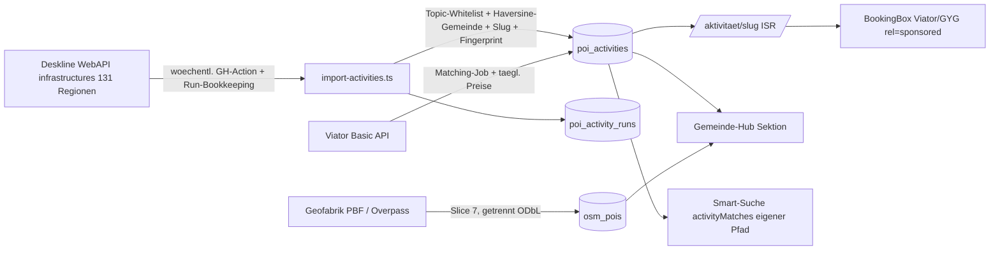

# Freizeitaktivitäten: POI-Bestand, Affiliate & Smart-Suche

## Overview

Zweite, nie ablaufende Content-Säule neben ~280k Events: dauerhafte Freizeitaktivitäten (Mountaincart, Rodelbahnen, Hochseilgärten, Bäder, Klettersteige, Museen …) mit eigener Tabelle, Detailseiten, Gemeinde-Hub-Sektion, Affiliate-Monetarisierung (Viator/GetYourGuide analog Eventim) und Smart-Suche-Anbindung. Primärquelle: Feratel Deskline WebAPI `infrastructures` (live verprobt: blsalzb 11.600, donauooe 4.862, salzkammergut 4.031, burgenland 2.589 … → zehntausende POIs über die 131 REGIONS-Slugs). Sekundär: OSM (leisure 155.714 / tourism 120.735 / sport 42.411 Objekte in AT, Stand 2026-07-18). Recherche-Details: Session-Memory `project_freizeit_poi_sources.md`.

Verifizierte No-Gos: Outdooractive (API-Terms verlangen `noindex` — SEO-K.-o.), Google Places (nur place_id speicherbar, $32/1k), Komoot (keine öffentliche API), Bergfex/AllTrails.

## Scope

**In:** `poi_activities`-Tabelle + Deskline-Ingest (GH-Action), `/aktivitaet/[slug]`-Detailseiten, `/api/activities`, Gemeinde-Hub-Sektion „Freizeit & Ausflüge", Event↔Aktivität-Cross-Links, Viator-Basic-Integration + GYG-Deeplinks mit Buchungs-Box, Smart-Suche-Erweiterung, Sitemap-Restrukturierung (Index + Kind-Sitemaps), OSM-Slice (`osm_pois`, nur Hub-Listen), Quellen-Attribution, Doku-Pflege.

**Out:** Overture/Foursquare-Import · Karten-Layer auf /map (Follow-up, map-points-Muster aus fn-16 liegt bereit) · On-site-Booking (Viator Full+Booking) · Betreiber-Preis-Scraping · GYG Partner-API (braucht 100k Visits/Monat; Ist ~13,9k PV/30d) · OSM-Detailseiten (Thin-Content-Risiko) · KI-Enrichment (Masterplan §6) · EN-Übersetzung der Aktivitätsinhalte (nach fn-17; Canonical-Regel siehe E13).

## Approach — getroffene Entscheidungen (E1–E13)

- **E1 Tabellenname `poi_activities`** — `activities` ist die Social-Feed-Tabelle (supabase/migrations/20260424_activities_delete_policy.sql, `auth.uid() = user_id`). Public-URLs bleiben `/aktivitaet/[slug]` und `/api/activities`.
- **E2 Ingest als Standalone-Script** `src/scripts/import-activities.ts` analog `import-eventim.ts` — NICHT in die Scraper-Registry (`runScraper` ist hart auf `syncEventsToSupabase`/events verdrahtet, src/lib/scrapers/index.ts:494-571). REGIONS-Liste + 429-Backoff aus FeratelScraper.ts:28-181/:444-481 wiederverwenden, Concurrency ≤6 (Feratel-IP-Limit ~3500 calls/h).
- **E3 Eigenes Taxonomie-Modul** `src/lib/activities/taxonomy.ts` (Deskline-Topic→Tag-Whitelist-Mapping). `enrichment-taxonomy.ts` wird NICHT angefasst → kein Merge-Konflikt mit fn-14; Konsolidierung ins SoT später als koordinierter Folgeschritt.
- **E4 Gemeinde-Zuordnung per nearest-Haversine** aus lat/lng gegen die Gemeinde-Registry (src/lib/gemeinden/data.ts, 2.028 Einträge) — kein String-Match auf `town` (mehrdeutig). POIs ohne Koordinaten werden übersprungen.
- **E5 Stabile Slugs**: `{slugify(name)}-{shortid}` mit shortid = **erste 12 Hex-Zeichen von sha1(`${source}:${source_id}`)** (48 bit — 8 Hex/32 bit hätte bei 20k+ Rows reale Kollisionsgefahr); beim ersten Insert fixiert, bei Re-Imports nie regeneriert (SEO-URL-Stabilität). Resolver: exakter Slug, sonst Shortid-Lookup → 301 auf aktuellen Slug.
- **E6 Prune mit Run-Bookkeeping**: eigene Tabelle `poi_activity_runs` (run_id, **run_seq monoton** — UUIDs sind nicht zeitlich ordbar, alle Ordnungsentscheidungen laufen über run_seq —, started_at, finished_at, regions_ok, regions_failed, is_complete) + pro Row `last_seen_run_seq` (Provenienz, jeder full_attempt), `last_seen_complete_run_seq` (**NUR complete_runs; Prune und Canonical-Liveness rechnen ausschließlich damit**), `last_seen_at` und `seen_regions text[]`. **Begriffe (verbindlich für alle Tasks):** `full_attempt` = Lauf, der alle 131 Regionen VERSUCHT (auch mit Fehl-Regionen); `complete_run` = full_attempt mit 0 in regions_failed. **Schreibrechte-Matrix:** full_attempt → schreibt Runs-Zeile (is_complete entsprechend), Sichtungsfelder (last_seen_run_seq/last_seen_at/seen_regions) für gesehene Rows und rekonsolidiert Canonicals; complete_run → zusätzlich einziger Zähler für die Prune-Schwelle; `--region` → nur Daten-Upsert + Rekonsolidierung der berührten Fingerprint-Gruppen (alte UND neue Gruppe bei Fingerprint-Änderung), KEINE Runs-Zeile, KEINE Sichtungsfelder, kein Prune; `--dry-run` → schreibt gar nichts. **Bootstrap-Regel:** Solange weniger als 2 komplette Läufe existieren, ist Prune vollständig deaktiviert und alle Rows gelten als „alive". Prune: `visible=false` erst, wenn eine Row in den letzten 2 kompletten Läufen nicht gesehen wurde. Prune arbeitet auf **Fingerprint-Gruppen** (E11): eine Gruppe bleibt sichtbar, solange irgendein Mitglied in den letzten 2 kompletten Läufen gesehen wurde — vor dem Prune wird das Canonical ggf. auf ein lebendes Mitglied umgewählt. Damit können Teil-/Fehlläufe niemals fälschlich Rows verstecken und ein POI verschwindet nie, solange eine Quelle ihn noch liefert.
- **E7 Noindex-Gate gegen Thin-Content** (70 % SEO-Traffic!): indexierbar nur mit Beschreibung ≥200 Zeichen ODER (Bild + Öffnungszeiten); sonst `robots noindex` — Muster Events-Gate src/app/[locale]/events/[...slug]/page.tsx:44-74. Zusätzlich kuratierte Topic-Whitelist beim Ingest (Action/Freizeit/Familie/Bäder/Kultur; Gastro/Shops/E-Ladestationen etc. werden nicht importiert).
- **E8 „Jetzt geöffnet" client-seitig** (Europe/Vienna) — ISR-Seite bleibt statisch korrekt (revalidate=3600). **Persistierter opening_times-Vertrag:** `opening_times_raw jsonb` (Deskline-Original, nur Debug/Reprocessing) + `opening_times jsonb` (normalisiert, EINZIGER Lesepfad) als Array von `{from:'YYYY-MM-DD', to:'YYYY-MM-DD', timeFrom:'HH:MM', timeTo:'HH:MM', weekdays:<Bitmaske Mo=1…So=64, null=alle Tage>}`; `timeFrom==timeTo=='00:00'` = durchgehend geöffnet. Badge und Noindex-Gate werten ausschließlich das normalisierte Feld.
- **E9 Smart-Suche additiv, eigener Pfad**: Response bekommt separates Feld `activityMatches` über eine **eigene Retrieval-Funktion** (kein Overload von `fetchCandidates`, das event-spezifisch bleibt); `rankCandidates`/`SCORE_ORDER`/`baseQuery` (EXPLAIN-Kommentar!) unberührt. `SearchIntent.contentTypes` whitelisted, Default `['event']`. **`intentIsEmpty()` muss non-default `contentTypes` als Signal werten**, und: enthält `contentTypes` kein `'event'`, wird der Event-Retrieval-Pfad **inklusive Top-Score-Fallback gar nicht aufgerufen** (`matches=[]`); der Activity-Pfad läuft nur bei enthaltenem `'activity'`. Events-Invariante `filter_after_date >= NOW()` bleibt; Regressionstest Pflicht.
- **E10 Crons als GH-Actions** (Masterplan: Imports weg von Vercel): wöchentlicher Ingest + täglicher Viator-Preis-Refresh, Vorlage import-eventim.yml; Secrets in BEIDE Stores (GitHub Actions + Vercel-Env).
- **E11 Dedup-Fallback unabhängig von der Mirror-GUID-Frage**: zusätzlich zur UNIQUE(source, source_id) bekommt jede Row einen `content_fingerprint` (Hash aus normalisiertem Namen + exakt quantisierten Koordinaten: `round(lat*1000)/1000`, `round(lng*1000)/1000` — Grid ~111 m × ~75 m in AT; Heuristik, Grid-Kanten-Effekte akzeptiert). Liefern Mirror-Regionen doch unterschiedliche GUIDs, werden Fingerprint-Duplikate deterministisch markiert (`duplicate_of`, Nicht-Kanonische `visible=false`). Die **Canonical-Wahl erfolgt auf Gruppen-Ebene und ist stabil-deterministisch**: das bestehende Canonical bleibt, solange es lebt; erst wenn es tot ist, wird neu gewählt (Reihenfolge: ältestes `created_at`, dann lexikographisch kleinste `source_id`) — das verhindert Canonical-Flapping und 301-Churn, auch wenn Mirror-Rows dieselbe run_seq teilen. Eine Gruppe verschwindet nur, wenn ALLE Mitglieder ungesehen sind. `--region`-Läufe rekonsolidieren die von ihnen berührten Fingerprint-Gruppen nach derselben Canonical-Regel (damit nie zwei sichtbare Canonicals einer Gruppe entstehen), haben aber weiterhin keine Sichtungs-/Prune-Wirkung. Das Schema aus Task 1 bleibt damit korrekt, egal wie der Overlap-Report in Task 2 ausgeht. Das konkrete Spaltenschema ist in Task 1 verbindlich definiert.
- **E12 Sitemap-Split JETZT** (kein „ggf."): `src/app/sitemap.xml/route.ts` wird zum **Sitemap-Index** (`<sitemapindex>`), der auf neue Kind-Routen zeigt: `/sitemap-core.xml` (Statisch/Hubs/Themen/Studenten/Venues **und Blog: /blog + alle Posts**), `/sitemap-events.xml` (bestehende Event-Logik inkl. MAX_EVENTS-Cap), `/sitemap-activities.xml` (nur indexierbare Aktivitäten, E7-Gate). Volle URL-Parität: JEDE bisherige Sitemap-Sektion landet in genau einer Kind-Sitemap. robots.txt zeigt weiter auf /sitemap.xml; nach Deploy Sitemap in GSC neu einreichen.
- **E13 /en-Canonical-Regel**: Solange keine EN-Übersetzung der Aktivitätsinhalte existiert, rendert `/en/aktivitaet/*` DE-Content mit `canonical` auf die DE-URL, ohne hreflang-Paar, und Aktivitäts-URLs erscheinen ausschließlich als DE-URLs in der Sitemap (Muster der Event-Detailseiten spiegeln). Kein Duplicate-Content-Risiko, keine Implementierungs-Interpretation.

Affiliate-Fakten (verifiziert): Viator Basic — Auth-Header `exp-api-key`, Base `https://api.viator.com/partner`, Scope `/products/search`, `/products/{code}`, `/availability/schedules`; ~150 req/10 s; keine modified-since-Endpoints. **Caching-Politik (verbindlich, gilt auch für Task 5):** Produkt-Stammdaten (Titel, Beschreibung, Bilder, product_code) sind lokal speicherbar und werden täglich refresht; Preise/Verfügbarkeit sind kurzlebig — Anzeige nur als „ab €" mit täglichem Refresh + Hinweis „Preis kann abweichen"; die exakten vertraglichen TTLs werden beim Viator-Onboarding verifiziert und als Konstanten im Client dokumentiert. Deeplink-`pid`-Format beim Implementieren in der Browser-Doku (docs.viator.com/partner-api/affiliate/technical/) prüfen. GYG: Deeplinks/Widgets mit partner_id, 31-Tage-Cookie. Alle Affiliate-Links `rel="sponsored nofollow"` + sichtbare Kennzeichnung; Tracking via `data-track="activity_click"` (globaler ClickTracker frisst neue Werte ohne Codeänderung).



## Quick commands

```bash
npx tsx src/scripts/import-activities.ts --region burgenland --dry-run   # Ingest-Smoke
npm test -- activities                                                   # Lib-Tests
curl -s "localhost:3000/api/activities?gemeinde=7100-neusiedl-am-see"    # API-Smoke
curl -s localhost:3000/sitemap.xml | head                                # Sitemap-Index-Smoke
```

## Risks / Dependencies

- **Thin-Content-SEO**: größtes Risiko bei 20k+ Seiten → E7-Gate + Topic-Whitelist; Sitemap nur indexierbare URLs (E12).
- **Sitemap-Restrukturierung**: /sitemap.xml wird Index — einmaliger GSC-Resubmit nötig; Kind-Sitemaps müssen jede <50k URLs bleiben.
- **Deskline-Grauzone**: permanentes Betriebs-Verzeichnis hat höhere Sichtbarkeit als transiente Events — Takedown-Prozess wie bei Events, Bilder nur mit Copyright-Anzeige; finaler Sign-off liegt beim Betreiber der Plattform.
- **Viator/GYG-Konten**: menschliche Voraufgabe (Registrierung, ToS-Akzeptanz, Keys) — blockiert Task 5, nicht die Slices 1–4.
- **Mirror-GUID-Annahme**: durch E11 (Fingerprint-Fallback) schema-seitig entschärft; Task-2-Overlap-Report entscheidet nur noch, ob die Fallback-Regel praktisch greift.
- **fn-17 (i18n, 2 Tasks offen)**: Route liegt von Anfang an unter `[locale]/`; neue UI-Strings koordinieren (messages/*.json-Merge). **fn-14**: durch E3 (eigenes Modul) kein Datei-Konflikt mehr — deshalb bewusst KEINE harte Epic-Dependency gesetzt. **fn-13**: berührt später dieselbe Gemeinde-Hub-Datei — PR-Koordination genügt.

## Acceptance

- [ ] ≥20.000 sichtbare Aktivitäten mit Koordinaten + Gemeinde-Zuordnung in `poi_activities` (Deskline, dedupliziert via source_id + Fingerprint-Fallback)
- [ ] `/aktivitaet/[slug]` live: Öffnungszeiten/„Jetzt geöffnet", Karte, Quellen- + Bild-Attribution; Noindex-Gate aktiv; `/en/aktivitaet/*` canonicalisiert auf DE (E13)
- [ ] Gemeinde-Hub-Sektion ab ≥3 Aktivitäten; Event-Detail zeigt Aktivitäten in der Nähe; Links beidseitig
- [ ] Smart-Suche: „wo kann ich mountaincart fahren" liefert `activityMatches` (eigener Pfad, intentIsEmpty-Fix); Activity-only-Queries rufen den Event-Fallback nicht auf; Regressionstest belegt unveränderte Event-Queries (future-only)
- [ ] Viator-Box bei Produkt-Match mit „ab €", `rel="sponsored"`, `data-track="activity_click"`-Klicks in analytics_events; graceful ohne Keys. GYG: Helper-Scaffold hinter Feature-Flag, Live-Schaltung erst nach Verifikation des Deeplink-Formats im Partner-Portal (bewusst KEIN Abnahme-Kriterium)
- [ ] Sitemap-Index live: /sitemap.xml (`<sitemapindex>`) → sitemap-core/-events/-activities; jede Kind-Datei <50k URLs; nur indexierbare Aktivitäts-URLs
- [ ] Prune nachweislich sicher: Teil-/Fehllauf versteckt keine Rows (Test über poi_activity_runs-Bookkeeping)
- [ ] OSM-Slice: `osm_pois` befüllt (kuratierte Whitelist), nur Hub-Listen, strikt getrennt, „© OpenStreetMap contributors" + ODbL-Link auf /quellen
- [ ] Doku: CLAUDE.md (Pfade/Betrieb), MASTERPLAN (Monetarisierung/Roadmap), /quellen (Deskline-POIs, Viator, GYG, OSM), CHANGELOG
- [ ] Vitest: Topic-Mapping, validateIntent(contentTypes) + intentIsEmpty, Ingest-Dedup + Fingerprint, €-Regex-Anti-Patterns, Slug-Stabilität (Baseline-Vergleich)

## Review-Status (2026-07-19)

19 Runden Codex-Plan-Review (GPT, Receipt-Kontinuität) durchlaufen; ~60 Findings eingearbeitet (u. a. Tabellen-Rename wegen Social-Feed-Kollision, Run-Bookkeeping mit run_seq/complete_run-Matrix, Gruppen-Canonical mit Crash-Recovery, Sitemap-Index-Split inkl. hreflang-Parität, RLS-visible-only + Server-Resolver, is_closed-Politik, No-AI-Klassifikator + Gemeinde-Extractor mit Ambiguitäts-Regeln). Kernarchitektur seit Runde 13 ohne Blocker-Befund. Formal blieb das letzte Verdict NEEDS_WORK — der Loop wurde nach Einarbeitung der Runde-19-Findings bewusst beendet (asymptotisch kleinteiligere Findings, Kosten/Nutzen). Wer weitere Härtung will: `flowctl codex plan-review fn-18-freizeitaktivitaeten-poi-bestand` mit Receipt fortsetzen.

## References

- FeratelScraper REGIONS + fetchApi/Backoff: src/lib/scrapers/FeratelScraper.ts:28-181, :444-481
- Registry-Kopplung an events (Warum Standalone-Script): src/lib/scrapers/index.ts:494-571
- Batch-Upsert + NULL-Clobber-Falle: src/lib/db/supabase-sync.ts:334-350, :729-788
- ISR-Detailseiten-Vorlage + noindex-Gate + canonical/hreflang-Muster: src/app/[locale]/events/[...slug]/page.tsx:33-149
- Gemeinde-Hub Nearby-Muster: src/app/[locale]/gemeinde/[slug]/page.tsx:85-116; Geo-Helpers: src/lib/gemeinden/data.ts
- Affiliate-Box + Tracking: src/components/Events/v4/V4TicketBox.tsx:83-85; src/components/Analytics/ClickTracker.tsx:23-48
- Smart-Suche-Andockstellen: src/lib/search/smart-query.ts:216-296 (inkl. intentIsEmpty :286); src/app/api/search/semantic/route.ts:66-120, :195-275 (SCORE_ORDER :177-193 NICHT anfassen)
- Cursor-Pagination: src/app/api/events/route.ts:668-691; Sitemap: src/app/sitemap.xml/route.ts (wird Index, E12)
- OSM-Vorlage: src/scripts/import-osm-venues.ts, package.json:60-62
- GH-Action-Vorlage: .github/workflows/import-eventim.yml
- Extern: docs.viator.com/partner-api/affiliate/technical/ · partnerresources.viator.com/travel-commerce/levels-of-access/ · partner.getyourguide.com · supabase.com/docs/reference/javascript/upsert · next-intl.dev/docs/routing · osmcode.org/osmium-tool/manual.html · developers.google.com/search/docs/crawling-indexing/qualify-outbound-links

## Tasks (7, Abhängigkeiten in Klammern)

1. Fundament: `poi_activities` + `poi_activity_runs`-Migrationen + Activity-Lib (Mapping, Slug, Gemeinde-Match, Preis-Regex, Fingerprint) inkl. konkreter Index-Migration — M
2. Deskline-Ingest-Script + Run-Bookkeeping/Prune + GH-Action (1) — M
3. `/api/activities` + Detailseite + Sitemap-Split (Index + Kind-Sitemaps) + /quellen + E13-Canonical (2) — M
4. Gemeinde-Hub-Sektion + Cross-Links in BEIDE Richtungen (Aktivität→Events + Event→Aktivitäten) (3) — S/M
5. Viator/GYG-Monetarisierung: Client, Matching, BookingBox, Preis-Refresh (3) — M
6. Smart-Suche: contentTypes + intentIsEmpty-Fix + eigener activityMatches-Pfad + UI-Block (3) — M
7. OSM-Slice `osm_pois` + Hub-Listen + Abschluss-Doku (4) — M
