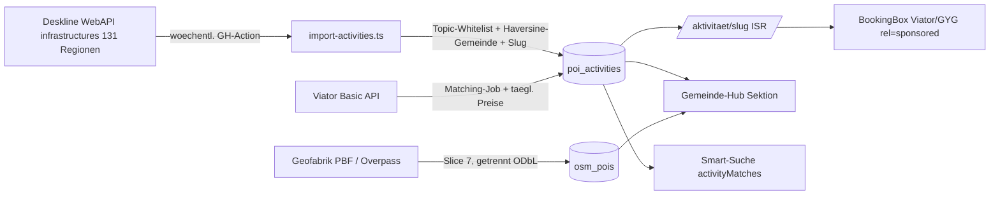

# Freizeitaktivitäten: POI-Bestand, Affiliate & Smart-Suche

## Overview

Zweite, nie ablaufende Content-Säule neben ~280k Events: dauerhafte Freizeitaktivitäten (Mountaincart, Rodelbahnen, Hochseilgärten, Bäder, Klettersteige, Museen …) mit eigener Tabelle, Detailseiten, Gemeinde-Hub-Sektion, Affiliate-Monetarisierung (Viator/GetYourGuide analog Eventim) und Smart-Suche-Anbindung. Primärquelle: Feratel Deskline WebAPI `infrastructures` (live verprobt: blsalzb 11.600, donauooe 4.862, salzkammergut 4.031, burgenland 2.589 … → zehntausende POIs über die 131 REGIONS-Slugs). Sekundär: OSM (leisure 155.714 / tourism 120.735 / sport 42.411 Objekte in AT, Stand 2026-07-18). Recherche-Details: Session-Memory `project_freizeit_poi_sources.md`.

Verifizierte No-Gos: Outdooractive (API-Terms verlangen `noindex` — SEO-K.-o.), Google Places (nur place_id speicherbar, $32/1k), Komoot (keine öffentliche API), Bergfex/AllTrails.

## Scope

**In:** `poi_activities`-Tabelle + Deskline-Ingest (GH-Action), `/aktivitaet/[slug]`-Detailseiten, `/api/activities`, Gemeinde-Hub-Sektion „Freizeit & Ausflüge", Event↔Aktivität-Cross-Links, Viator-Basic-Integration + GYG-Deeplinks mit Buchungs-Box, Smart-Suche-Erweiterung, Sitemap, OSM-Slice (`osm_pois`, nur Hub-Listen), Quellen-Attribution, Doku-Pflege.

**Out:** Overture/Foursquare-Import · Karten-Layer auf /map (Follow-up, map-points-Muster aus fn-16 liegt bereit) · On-site-Booking (Viator Full+Booking) · Betreiber-Preis-Scraping · GYG Partner-API (braucht 100k Visits/Monat; Ist ~13,9k PV/30d) · OSM-Detailseiten (Thin-Content-Risiko) · KI-Enrichment (Masterplan §6) · EN-Übersetzung der Aktivitätsinhalte (nach fn-17; Route ist aber von Anfang an locale-fähig).

## Approach — getroffene Entscheidungen (E1–E10)

- **E1 Tabellenname `poi_activities`** — `activities` ist die Social-Feed-Tabelle (supabase/migrations/20260424_activities_delete_policy.sql, `auth.uid() = user_id`). Public-URLs bleiben `/aktivitaet/[slug]` und `/api/activities`.
- **E2 Ingest als Standalone-Script** `src/scripts/import-activities.ts` analog `import-eventim.ts` — NICHT in die Scraper-Registry (`runScraper` ist hart auf `syncEventsToSupabase`/events verdrahtet, src/lib/scrapers/index.ts:494-571). REGIONS-Liste + 429-Backoff aus FeratelScraper.ts:28-181/:444-481 wiederverwenden, Concurrency ≤6 (Feratel-IP-Limit ~3500 calls/h).
- **E3 Eigenes Taxonomie-Modul** `src/lib/activities/taxonomy.ts` (Deskline-Topic→Tag-Whitelist-Mapping). `enrichment-taxonomy.ts` wird NICHT angefasst → kein Merge-Konflikt mit fn-14; Konsolidierung ins SoT später als koordinierter Folgeschritt.
- **E4 Gemeinde-Zuordnung per nearest-Haversine** aus lat/lng gegen die Gemeinde-Registry (src/lib/gemeinden/data.ts, 2.028 Einträge) — kein String-Match auf `town` (mehrdeutig). POIs ohne Koordinaten werden übersprungen.
- **E5 Stabile Slugs**: `{slugify(name)}-{shortid aus source_id}`; beim ersten Insert fixiert, bei Re-Imports nie regeneriert (SEO-URL-Stabilität). Resolver: exakter Slug, sonst Shortid-Lookup → 301 auf aktuellen Slug.
- **E6 Prune statt Löschen**: `last_seen_at` pro Lauf; `visible=false` erst nach 2 kompletten Läufen ohne Sichtung; Regionen mit Fehlern im Lauf sind vom Prune ausgenommen (Teilimport-Schutz).
- **E7 Noindex-Gate gegen Thin-Content** (70 % SEO-Traffic!): indexierbar nur mit Beschreibung ≥200 Zeichen ODER (Bild + Öffnungszeiten); sonst `robots noindex` — Muster Events-Gate src/app/[locale]/events/[...slug]/page.tsx:44-74. Zusätzlich kuratierte Topic-Whitelist beim Ingest (Action/Freizeit/Familie/Bäder/Kultur; Gastro/Shops/E-Ladestationen etc. werden nicht importiert).
- **E8 „Jetzt geöffnet" client-seitig** aus `opening_times` jsonb berechnet (Europe/Vienna) — ISR-Seite bleibt statisch korrekt (revalidate=3600).
- **E9 Smart-Suche additiv**: Response bekommt separates Feld `activityMatches` (eigener UI-Block „Passende Aktivitäten") statt Interleaving — `rankCandidates`/`SCORE_ORDER`/`baseQuery` (EXPLAIN-Kommentar!) bleiben unberührt; bestehende Consumer (V4EntdeckenSmartMode, Concierge) brechen nicht. `SearchIntent.contentTypes` whitelisted, Default `['event']`. Events-Invariante `filter_after_date >= NOW()` bleibt; Regressionstest Pflicht.
- **E10 Crons als GH-Actions** (Masterplan: Imports weg von Vercel): wöchentlicher Ingest + täglicher Viator-Preis-Refresh, Vorlage import-eventim.yml; Secrets in BEIDE Stores (GitHub Actions + Vercel-Env).

Affiliate-Fakten (verifiziert): Viator Basic — Auth-Header `exp-api-key`, Base `https://api.viator.com/partner`, Scope `/products/search`, `/products/{code}`, `/availability/schedules`; ~150 req/10 s; Produktdaten ≤1 h cachen, keine modified-since-Endpoints; Deeplink-`pid`-Format beim Implementieren in der Browser-Doku (docs.viator.com/partner-api/affiliate/technical/) prüfen. GYG: Deeplinks/Widgets mit partner_id, 31-Tage-Cookie. Alle Affiliate-Links `rel="sponsored nofollow"` + sichtbare Kennzeichnung; Tracking via `data-track="activity_click"` (globaler ClickTracker frisst neue Werte ohne Codeänderung).



## Quick commands

```bash
npx tsx src/scripts/import-activities.ts --region burgenland --dry-run   # Ingest-Smoke
npm test -- activities                                                   # Lib-Tests
curl -s "localhost:3000/api/activities?gemeinde=7100-neusiedl-am-see"    # API-Smoke
```

## Risks / Dependencies

- **Thin-Content-SEO**: größtes Risiko bei 20k+ Seiten → E7-Gate + Topic-Whitelist; Sitemap nur indexierbare URLs.
- **Sitemap-Kapazität**: sitemap.xml/route.ts hat MAX_EVENTS=45000 nahe am 50k-Limit → Aktivitäten als eigene Sitemap-Sektion/Datei.
- **Deskline-Grauzone**: permanentes Betriebs-Verzeichnis hat höhere Sichtbarkeit als transiente Events — Takedown-Prozess wie bei Events, Bilder nur mit Copyright-Anzeige; finaler Sign-off liegt beim Betreiber der Plattform.
- **Viator/GYG-Konten**: menschliche Voraufgabe (Registrierung, ToS-Akzeptanz, Keys) — blockiert Task 5, nicht die Slices 1–4.
- **Mirror-GUID-Annahme**: dass überlappende Deskline-Regionen identische GUIDs liefern, ist plausibel aber unverifiziert → wird im Ingest-Task empirisch geprüft (Overlap-Report zweier Regionen).
- **fn-17 (i18n, 2 Tasks offen)**: Route liegt von Anfang an unter `[locale]/`; neue UI-Strings koordinieren (messages/*.json-Merge). **fn-14**: durch E3 (eigenes Modul) kein Datei-Konflikt mehr — deshalb bewusst KEINE harte Epic-Dependency gesetzt. **fn-13**: berührt später dieselbe Gemeinde-Hub-Datei — PR-Koordination genügt.

## Acceptance

- [ ] ≥20.000 sichtbare Aktivitäten mit Koordinaten + Gemeinde-Zuordnung in `poi_activities` (Deskline, dedupliziert)
- [ ] `/aktivitaet/[slug]` live: Öffnungszeiten/„Jetzt geöffnet", Karte, Quellen- + Bild-Attribution; Noindex-Gate aktiv
- [ ] Gemeinde-Hub-Sektion ab ≥3 Aktivitäten; Event-Detail zeigt Aktivitäten in der Nähe; Links beidseitig
- [ ] Smart-Suche: „wo kann ich mountaincart fahren" liefert `activityMatches`; Regressionstest belegt unveränderte Event-Queries (future-only)
- [ ] Viator-Box bei Produkt-Match mit „ab €", `rel="sponsored"`, `data-track="activity_click"`-Klicks in analytics_events; GYG-Links mit partner_id; graceful ohne Keys
- [ ] Sitemap-Sektion nur mit indexierbaren Aktivitäts-URLs
- [ ] OSM-Slice: `osm_pois` befüllt (kuratierte Whitelist), nur Hub-Listen, strikt getrennt, „© OpenStreetMap contributors" + ODbL-Link auf /quellen
- [ ] Doku: CLAUDE.md (Pfade/Betrieb), MASTERPLAN (Monetarisierung/Roadmap), /quellen (Deskline-POIs, Viator, GYG, OSM), CHANGELOG
- [ ] Vitest: Topic-Mapping, validateIntent(contentTypes), Ingest-Dedup, €-Regex-Anti-Patterns, Slug-Stabilität (Baseline-Vergleich)

## References

- FeratelScraper REGIONS + fetchApi/Backoff: src/lib/scrapers/FeratelScraper.ts:28-181, :444-481
- Registry-Kopplung an events (Warum Standalone-Script): src/lib/scrapers/index.ts:494-571
- Batch-Upsert + NULL-Clobber-Falle: src/lib/db/supabase-sync.ts:334-350, :729-788
- ISR-Detailseiten-Vorlage + noindex-Gate: src/app/[locale]/events/[...slug]/page.tsx:33-149
- Gemeinde-Hub Nearby-Muster: src/app/[locale]/gemeinde/[slug]/page.tsx:85-116; Geo-Helpers: src/lib/gemeinden/data.ts
- Affiliate-Box + Tracking: src/components/Events/v4/V4TicketBox.tsx:83-85; src/components/Analytics/ClickTracker.tsx:23-48
- Smart-Suche-Andockstellen: src/lib/search/smart-query.ts:216-283; src/app/api/search/semantic/route.ts:66-120, :195-275 (SCORE_ORDER :177-193 NICHT anfassen)
- Cursor-Pagination: src/app/api/events/route.ts:668-691; Sitemap: src/app/sitemap.xml/route.ts
- OSM-Vorlage: src/scripts/import-osm-venues.ts, package.json:60-62
- GH-Action-Vorlage: .github/workflows/import-eventim.yml
- Extern: docs.viator.com/partner-api/affiliate/technical/ · partnerresources.viator.com/travel-commerce/levels-of-access/ · partner.getyourguide.com · supabase.com/docs/reference/javascript/upsert · next-intl.dev/docs/routing · osmcode.org/osmium-tool/manual.html · developers.google.com/search/docs/crawling-indexing/qualify-outbound-links

## Tasks (7, Abhängigkeiten in Klammern)

1. Fundament: `poi_activities`-Migration + Activity-Lib (Taxonomie-Mapping, Slug, Gemeinde-Match, Preis-Regex) — M
2. Deskline-Ingest-Script + GH-Action (1) — M
3. `/api/activities` + Detailseite + Sitemap + /quellen (2) — M
4. Gemeinde-Hub-Sektion + Cross-Links (3) — S/M
5. Viator/GYG-Monetarisierung: Client, Matching, BookingBox, Preis-Refresh (3) — M
6. Smart-Suche: contentTypes + activityMatches + UI-Block (3) — M
7. OSM-Slice `osm_pois` + Hub-Listen + Abschluss-Doku (4) — M
